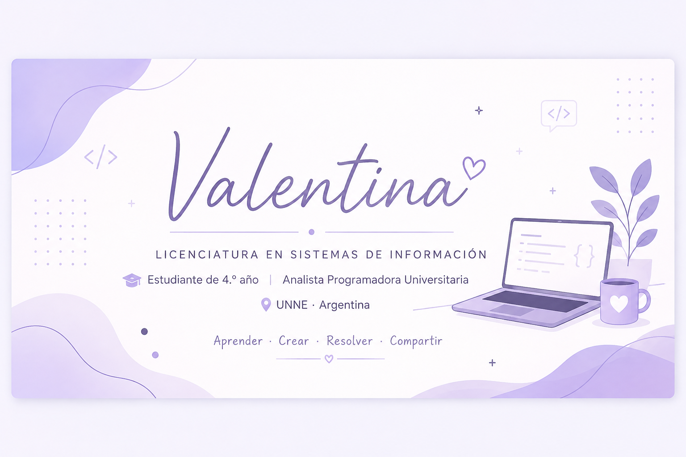

 

# ¡Hola! Soy Valentina 👋

### 🎓 Estudiante de 4.º año de Licenciatura en Sistemas de Información

**Analista Programadora Universitaria** · Título intermedio

🇦🇷 Universidad Nacional del Nordeste · UNNE

---

## 💜 Sobre mí

Soy estudiante de **Licenciatura en Sistemas de Información** y actualmente curso el cuarto año de la carrera.

Durante mi formación académica desarrollé proyectos grupales que me permitieron adquirir experiencia en **programación, bases de datos, análisis y diseño de sistemas y fundamentos de lenguajes de programación**.

Me gusta aprender a través de proyectos, seguir explorando nuevas tecnologías y transformar los conocimientos adquiridos en soluciones concretas.

---

## 🛠️ Tecnologías y conocimientos

### 💻 Lenguajes

  

### 🌐 Desarrollo y herramientas

  

### 📐 Análisis y diseño

`UML` · `Modelado de sistemas` · `Bases de datos`

### 🧠 Conceptos

`Expresiones regulares` · `Gramáticas` · `Análisis léxico` · `Análisis sintáctico` · `LL(1)` · `AST`

---

## 🚀 Proyectos destacados

<table>
<tr>

<td width="50%" valign="top">

### :books: UniVia

Plataforma orientada a compartir y consultar **material académico**, como apuntes, libros y otros recursos de estudio.

Proyecto grupal desarrollado en **Ingeniería de Software II**.

**Funcionalidades principales:**

- 🔎 Buscar materiales
- 📤 Subir materiales
- 📥 Descargar materiales

**Tecnologías**

`C#` · `SQL` · `Visual Studio`

</td>

<td width="50%" valign="top">

### 🍽️ Sistema de Gestión para Bar

**Aplicación de escritorio para la gestión de un bar de comidas**

Proyecto desarrollado como parte de la Licenciatura en Sistemas de Información.

Consiste en una aplicación de escritorio orientada a la **gestión de productos, pedidos y operaciones del bar**, buscando facilitar la organización y el manejo de la información.

**Incluye:**

* 📋 Gestión de productos y pedidos
* 🧾 Registro y consulta de información
* 🖥️ Interfaz de escritorio
* 🗄️ Gestión y almacenamiento de datos

**Tecnologías**

`.NET` · `Visual Studio` · `SQL Server`

</td>

</tr>
</table>

---

## :bulb: Actualmente aprendiendo

Continuando mi formación mediante proyectos académicos, práctica y aprendizaje constante.

📱 **Proyecto personal en exploración**

Estoy comenzando a desarrollar la idea de una **aplicación móvil educativa orientada al aprendizaje de la lectura infantil**, con funcionalidades relacionadas con el reconocimiento de letras y el acompañamiento del proceso de aprendizaje.

> Este proyecto se encuentra en una etapa inicial y se irá actualizando a medida que avance su desarrollo.

---

## 🎓 Formación

**Licenciatura en Sistemas de Información**  
Universidad Nacional del Nordeste · UNNE  
**4.º año · En curso**

**Analista Programadora Universitaria**  
Título intermedio de la Licenciatura en Sistemas de Información

---

## 📫 Contacto

💻 **GitHub**

🔗 **LinkedIn**

*Próximamente*

 

---

